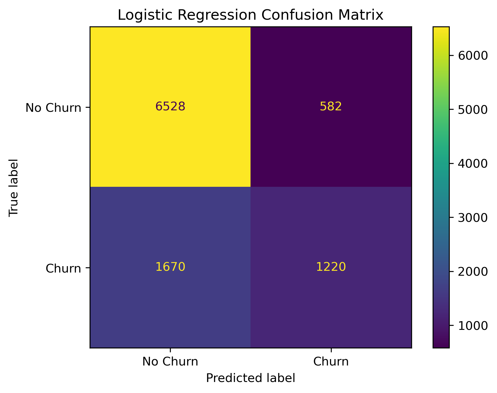
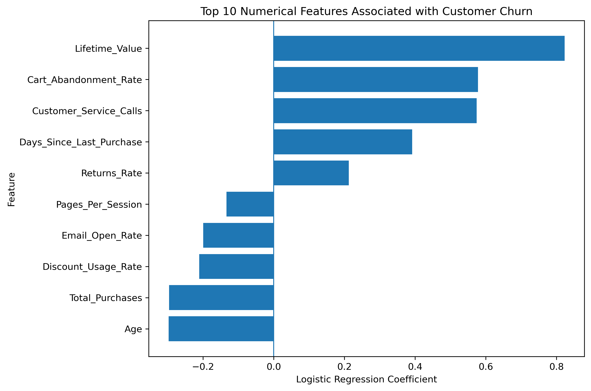

# Customer Churn Prediction with Logistic Regression

Project Overview

Customer churn is an important business problem because identifying customers who may leave can help organizations develop more effective retention strategies.

In this project, I developed an end-to-end classification workflow using Logistic Regression to predict customer churn based on customer demographics, purchasing behavior, engagement, and service-related characteristics.

The analysis covers the complete modeling process, including data inspection, missing-value handling, feature preprocessing, feature scaling, categorical encoding, model training, performance evaluation, confusion matrix analysis, and interpretation of Logistic Regression coefficients.

A key focus of this project is looking beyond overall accuracy and examining precision, recall, and F1-score to understand how effectively the model identifies customers who actually churn.

⸻

Business Question

Can customer characteristics and behavioral patterns be used to predict whether a customer is likely to churn?

The analysis also explores:

* How effectively can Logistic Regression distinguish churners from non-churners?
* Which customer characteristics are most strongly associated with predicted churn?
* Does overall model accuracy provide a complete picture of performance?
* What limitations should be considered when using the model for customer retention decisions?

⸻

Dataset

The dataset contains 50,000 customer records and 25 variables, including customer demographics, purchasing behavior, engagement metrics, service interactions, and the churn outcome.

The target variable is:

* Churned = 0 → Customer did not churn
* Churned = 1 → Customer churned

The target distribution shows a moderate class imbalance:

* 71.1% non-churners
* 28.9% churners

Several numerical features contain missing values, which are handled as part of the preprocessing workflow.

⸻

Modeling Workflow

The project follows a structured machine-learning workflow:

1. Data inspection and quality checks
2. Missing-value analysis
3. Target distribution analysis
4. Feature and target definition
5. Stratified train/test split
6. Median imputation for numerical missing values
7. Standardization of numerical features
8. One-hot encoding of categorical variables
9. Logistic Regression model training
10. Prediction and probability estimation
11. Model evaluation using multiple classification metrics
12. Confusion matrix analysis
13. Logistic Regression coefficient interpretation

All preprocessing transformations are learned from the training data only and then applied to the test data to reduce the risk of data leakage.

⸻

Model Performance

The Logistic Regression model achieved the following results on the unseen test set:

Metric	Score
Accuracy	77.5%
Precision (Churn)	67.7%
Recall (Churn)	42.2%
F1-Score (Churn)	52.0%

The model’s 77.5% accuracy exceeds the 71.1% majority-class baseline. However, accuracy alone does not fully describe the model’s ability to identify customers at risk of churn.

The relatively lower churn recall indicates that a meaningful number of actual churners remain undetected.

⸻

Confusion Matrix Analysis

On the 10,000-customer test set, the model produced:

	Predicted No Churn	Predicted Churn
Actual No Churn	6,528	582
Actual Churn	1,670	1,220

This means the model:

* Correctly identified 6,528 non-churners
* Correctly identified 1,220 churners
* Incorrectly flagged 582 non-churners as churners
* Missed 1,670 customers who actually churned

### Confusion Matrix

The last result is particularly important from a business perspective. If the goal is proactive customer retention, failing to identify a customer who is likely to churn may represent a missed opportunity for intervention.

⸻

Key Feature Insights

Logistic Regression coefficients were examined to understand which numerical features were most strongly associated with the model’s churn predictions.

### Most Influential Numerical Features

Stronger Positive Associations with Churn

The largest positive coefficients included:

* Lifetime Value
* Cart Abandonment Rate
* Customer Service Calls
* Days Since Last Purchase

Higher values of these features were associated with higher predicted odds of churn, holding the other model variables constant.

Negative Associations with Churn

Several features showed negative coefficients, including:

* Age
* Total Purchases
* Discount Usage Rate
* Email Open Rate
* Pages Per Session

Higher values of these features were associated with lower predicted odds of churn within the fitted model.

These relationships should be interpreted as predictive associations rather than causal effects.

⸻

Key Takeaways

This project demonstrates why classification models should not be evaluated using accuracy alone.

Although the model achieved 77.5% overall accuracy, its churn recall was only 42.2%. In other words, the overall performance initially appears relatively strong, but a closer examination reveals that the model misses a substantial portion of customers who actually churn.

This distinction is especially important in churn prediction, where identifying at-risk customers is often the primary business objective.

The analysis also shows that customer purchasing behavior, service interactions, and engagement characteristics contain useful predictive information for churn modeling.

⸻

Limitations

The primary limitation of the current model is its relatively low recall for churners.

The dataset also has a moderate class imbalance, with churners representing 28.9% of observations. This should be considered when interpreting model performance.

Finally, the Logistic Regression coefficients describe relationships learned by the predictive model and should not be interpreted as evidence that a feature causes customer churn.

⸻

Potential Next Steps

Future analysis could explore:

* Adjusting the classification probability threshold
* Applying class weighting
* Comparing Logistic Regression with alternative classification models
* Evaluating ROC-AUC and Precision-Recall curves
* Performing additional feature engineering
* Investigating the trade-off between churn recall and precision

The goal would not simply be to maximize overall accuracy, but to develop a model that more effectively identifies customers at risk of leaving.

⸻

Tools and Technologies

* Python
* Pandas
* NumPy
* Scikit-learn
* Matplotlib
* Jupyter Notebook

⸻

Repository Contents

* customer_churn_logistic_regression.ipynb — Complete analysis and modeling workflow
* README.md — Project overview, methodology, results, and key findings

⸻

Conclusion

Logistic Regression provided an interpretable baseline for predicting customer churn and achieved 77.5% accuracy on unseen test data.

More importantly, evaluating the model beyond accuracy revealed a key limitation: only 42.2% of actual churners were successfully identified.

This project highlights the importance of connecting machine-learning metrics to the underlying business objective. A model can perform reasonably well overall while still underperforming on the class that matters most.

For customer retention applications, improving the identification of actual churners would therefore be a key priority for future model development.
